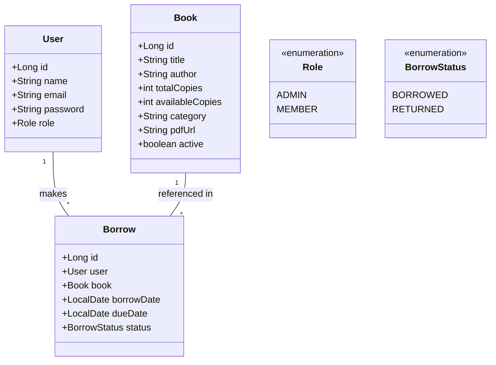
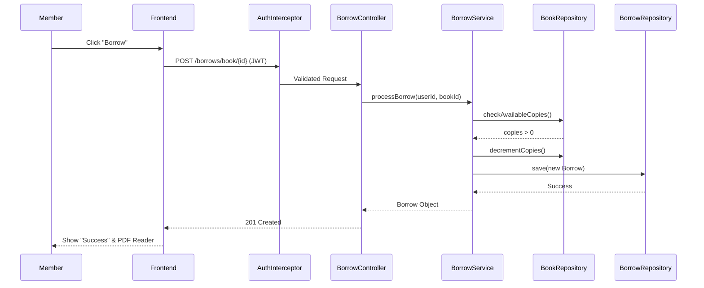
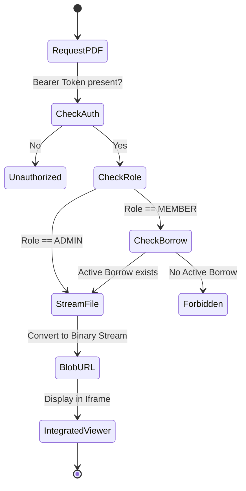

# 📖 LibSystem Technical Documentation

This document provides a comprehensive technical overview of the LibSystem E-Library Management System, including requirements, architecture, and design patterns.

---

## 1. Software Requirements Specification (SRS)

### 1.1 Functional Requirements (FR)
- **FR-1: Authentication & Security**: Users must authenticate via JWT to access protected resources. Passwords must be encrypted using BCrypt.
- **FR-2: Book Management (Admin)**: Admins shall be able to Create, Read, Update, and Delete book records and upload PDF files.
- **FR-3: Borrowing System**: Members shall be able to borrow books if copies are available. The system must decrement the available count instantly.
- **FR-4: Digital Reader**: The system shall provide a secure PDF viewer that streams content as a Blob URL to prevent direct link sharing.
- **FR-5: Analytics**: The admin dashboard must provide real-time counts of active borrows, total users, and inventory status.

### 1.2 Non-Functional Requirements (NFR)
- **NFR-1: Performance**: All API endpoints should respond within 200ms under normal load.
- **NFR-2: Scalability**: The backend should handle concurrent borrowing requests using ACID transactions.
- **NFR-3: Usability**: The frontend must provide a responsive, high-performance glassmorphic interface with clear status indicators.

### 1.3 Use Cases
- **Admin**: "Add New Book", "Upload Manuscript", "View User Activity", "Recall Borrowed Book".
- **Member**: "Search Catalog", "Borrow Book", "Read PDF Online", "Return Book".

---

## 2. UML Diagrams

### 2.1 Use Case Diagram
```mermaid
usecaseDiagram
    actor "Library Member" as Member
    actor "System Admin" as Admin

    package "LibSystem" {
        usecase "Login / Register" as UC1
        usecase "Browse Catalog" as UC2
        usecase "Borrow Book" as UC3
        usecase "Read PDF" as UC4
        usecase "Manage Inventory" as UC5
        usecase "View Analytics" as UC6
        usecase "Upload PDF" as UC7
    }

    Member --> UC1
    Member --> UC2
    Member --> UC3
    Member --> UC4

    Admin --> UC1
    Admin --> UC5
    Admin --> UC6
    Admin --> UC7
    Admin --> UC4
```

### 2.2 Class Diagram (Core Entities)


### 2.3 Sequence Diagram: Borrowing a Book


### 2.4 Activity Diagram: PDF Streaming Security


---

## 3. Design & Architecture

### 3.1 Architectural Pattern: Layered Architecture
The system follows the standard **N-Tier Layered Architecture**:
1.  **Presentation Layer**: Vue.js components and Pinia stores.
2.  **API Layer (Controller)**: Spring Boot RestControllers handling HTTP requests and DTO mapping.
3.  **Service Layer**: Business logic implementation (e.g., license validation, date calculation).
4.  **Data Access Layer (Repository)**: Spring Data JPA interfaces for MySQL interaction.

### 3.2 Design Patterns
- **Repository Pattern**: Used via Spring Data JPA to abstract database operations, allowing for easy testing and interchangeable data sources.
- **Singleton Pattern**: Spring Beans (Services, Controllers) are managed as singletons by the Spring IOC container.
- **Strategy Pattern**: Used in the Security Filter Chain to apply different authentication strategies based on URI patterns.
- **DTO (Data Transfer Object) Pattern**: Separates the database models from the API response structure to ensure security and reduce payload size.
- **Intercepting Filter Pattern**: Implemented via Axios interceptors (frontend) and Security Filters (backend) for cross-cutting concerns like logging and security.

---
*Documentation Generated for LibSystem v1.0.0*
